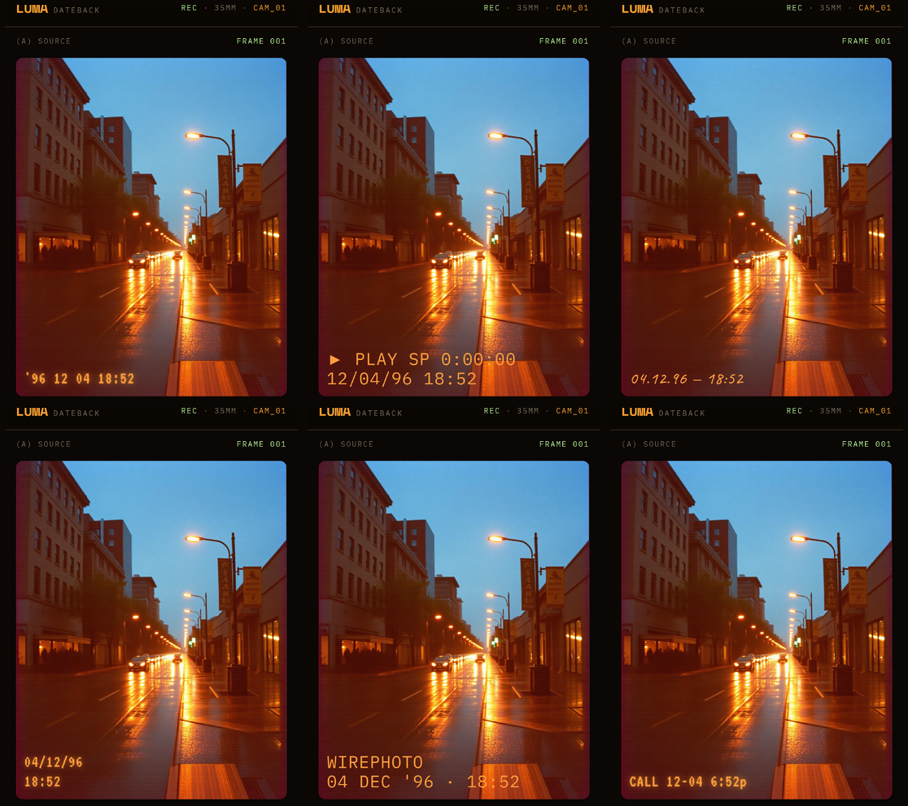
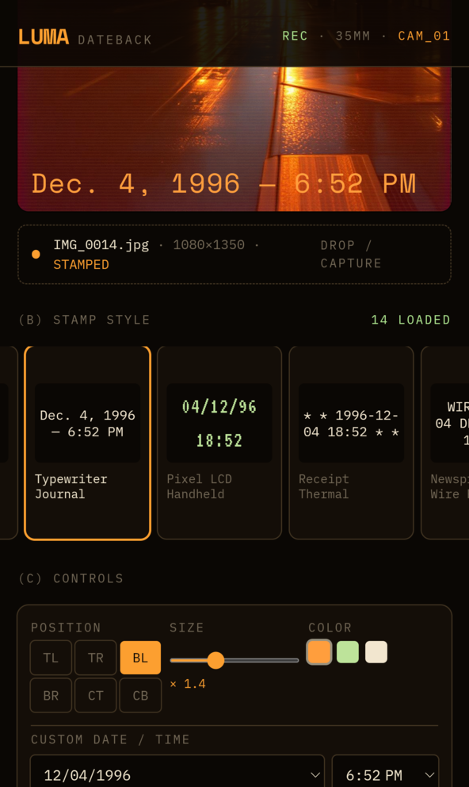

<div align="center">

# 🎞️ LUMA dateback

**Retro timestamps, burned onto your photos.**
*Web app · Native Android · Zero backend.*

[](https://github.com/pi0trdotsys/Retro-Stamp-Studio/releases/latest)
[](https://react.dev)
[](https://www.typescriptlang.org)
[](https://vitejs.dev)
[](https://tailwindcss.com)
[](https://capacitorjs.com)

</div>

<br>

<div align="center">
<sub>Upload a photo → pick a style → the shot's own EXIF date is proposed automatically → export a full‑resolution PNG.</sub>
</div>

<br>

---

## 🖼️ Screenshots

<div align="center">



<sub>Same frame, six of the fourteen styles.</sub>

<br><br>



<sub>Position · size · color · custom date & time.</sub>

</div>

<br>

---

## 📷 What it is

A single, data‑less screen. Fourteen ways to make a photo look like it came from something else — a 1996 point‑and‑shoot, a VHS camcorder, a Game Boy Camera, a wire‑service print, a boarding pass. Everything renders client‑side on a `<canvas>`, at the photo's native resolution, with no watermark and no server in the loop.

The same screen ships two ways: as a website, and as a signed native Android app — one design system, one codebase, no logic duplicated.

<br>

## 🏷️ Stamp styles

| | | |
|---|---|---|
| **Orange Quartz** — 7‑segment LCD | **VHS** — PLAY OSD | **Film Edge** — Kodak print |
| **Polaroid** — handwritten | **Terminal** — EXIF readout | **Digicam** — Y.M.D clean |
| **Typewriter** — 12h journal | **Pixel LCD** — Game Boy | **Receipt** — thermal print |
| **Newsprint** — wire photo | **Caller ID** — digital LED | **Boarding Pass** — ticket stub |
| **Arcade** — hi‑score screen | **Telegram** — STOP‑separated | |

Every style, position, scale, color, and custom date/time is defined in one file — [`src/lib/stamps.ts`](src/lib/stamps.ts).

<br>

## ⚙️ Under the hood

```
input           →  drag/drop or file capture, EXIF DateTimeOriginal read on upload
render          →  canvas at native resolution, shared by live preview and export
export (web)    →  Blob URL → <a download>
export (native) →  Filesystem.writeFile → native Share Sheet
```

No accounts. No backend. No analytics. The entire product is `src/lib/stamps.ts`, `src/lib/render-stamp.ts`, `src/lib/exif-date.ts`, and one route.

<br>

## 🚀 Run it

```bash
npm install
npm run dev
```

Build the Android APK (Capacitor):

```bash
npm run build:apk        # web build → cap sync → gradlew assembleDebug
```

A signed release build needs a local, git‑ignored `android/keystore.properties` — see [`android/app/build.gradle`](android/app/build.gradle).

<br>

## 🗂️ Structure

```
src/lib/stamps.ts        specification — presets, formatting, colors
src/lib/render-stamp.ts  canvas → PNG blob renderer
src/lib/exif-date.ts     EXIF capture-date detection
src/routes/index.tsx     the entire UI
apk/                     standalone client build, no SSR — feeds the Capacitor shell
android/                 native Android project
docs/IMPLEMENTATION.md   architecture notes for contributors
```

<br>

## 📲 Get the app

Signed APKs and the Play Store `.aab` are attached to every [release](https://github.com/pi0trdotsys/Retro-Stamp-Studio/releases/latest).

<br>

---

<div align="center">
<sub>Built with <a href="https://lovable.dev/projects/5fe479f0-9170-49b5-aa1c-48c6a0394dfc">Lovable</a> · engineered with <a href="https://claude.com/claude-code">Claude Code</a></sub>
</div>
